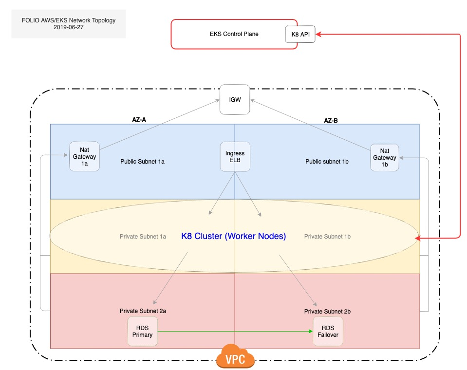

# create-eks-vpc

This role creates a typical VPC configuration in AWS suitable for running a FOLIO EKS cluster.

## Background



* In the diagram above, our VPC consists of two availability zones. The recommended minimum is two. Each availability zone consists of one public-facing subnet and two private subnets.

* EKS worker nodes reside in private subnets 1a and 1b and the FOLIO RDS database resides in private subnets 2a and 2b.

* Outbound connections from the private subnets to targets outside the VPC are routed through the NAT gateways available in each zone. NAT gateways require elastic IPs which are available in limited quantity so it is important to ensure there are at least two, available elastic IPs before creating a cluster in a given AWS region.

* Ingress traffic from the public-facing subnets to the cluster worker nodes is routed via an AWS network load balancer (L4 - NLB) or an AWS application load balancer (L7 - ALB).

* Communication between the cluster worker nodes and the AWS-managed EKS control plane occurs via ENI and a security group configuration.

Additional information on EKS VPC configuration can be found in the [AWS EKS documentation](https://docs.aws.amazon.com/eks/latest/userguide/network_reqs.htm)

## Prerequisites

This role uses Ansible modules that access the AWS API. An AWS access key and AWS secret key or session token must either be available in the environment, set in the [boto configuration](https://boto.readthedocs.io/en/latest/boto_config_tut.html), or passed in as a variable.

## Usage

Invoke this role in a playbook with `localhost` as the target to build the VPC, e.g.:

```yaml
- name: Create EKS VPC for FOLIO
  hosts: localhost
  connection: local
  gather_facts: no
  roles:
    - role: create-eks-vpc
      aws_region: us-east-2
```

## Variables

```yaml
---
# Defaults
aws_region: us-east-1
vpc_name: folio-eks
vpc_cidr: 172.16.0.0/16
# available_zones variable can contain an arbitrary number of dictionaries
availability_zones:
  us-east-1a:
    public_cidr: 172.16.1.0/24
    private_cidr_1: 172.16.2.0/24
    private_cidr_2: 172.16.3.0/24
  us-east-1b:
    public_cidr: 172.16.4.0/24
    private_cidr_1: 172.16.5.0/24
    private_cidr_2: 172.16.6.0/24

# Optional variables for AWS security credentials
# Can be set or passed in from other tasks/roles
# aws_access_key:
# aws_secret_key:
# sts_security_token:
```
